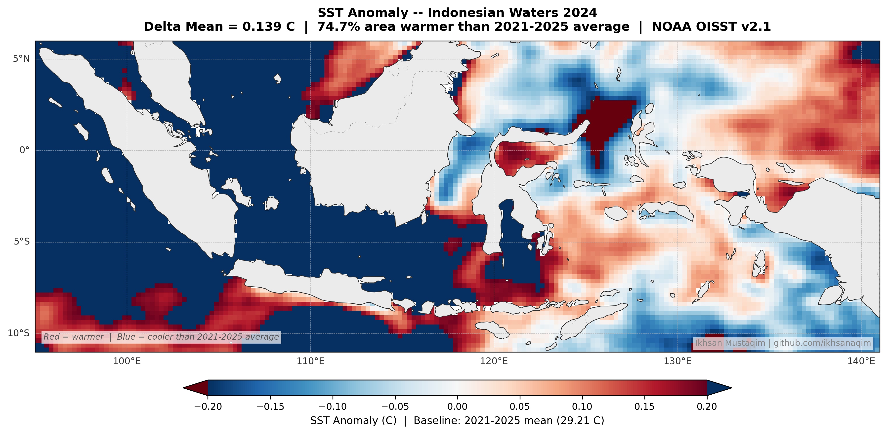

# 🌡️ Sea Surface Temperature Analysis — Indonesian Waters (2021–2025)

> **Geospatial Data Science | Python | NOAA OISST v2.1 | Plotly | Cartopy**

A data science project analyzing **5 years of sea surface temperature (SST) trends** across Indonesian waters using satellite-derived oceanographic data. Built as part of a geospatial data portfolio by [Ikhsan Mustaqim](https://linkedin.com/in/ikhsanaqim).

---

## 📊 Key Findings

| Metric | Value |
|---|---|
| SST Change (2021 → 2024) | **+0.156°C** |
| % Area Warmer in 2024 | **74.7%** of Indonesian waters |
| 2024 Anomaly vs Climatology | **+0.139°C** above 2021–2025 mean |
| 2023 Anomaly (El Nino signal) | **−0.218°C** — coldest year in period |
| November 2024 Peak SST | **30.07°C** — highest in 5 years |
| Warmest Month (5-yr avg) | **May (29.79°C)** |
| Coldest Month (5-yr avg) | **August (28.52°C)** |
| Climatological Mean | **29.215°C** (2021–2025 baseline) |

---

## 🗺️ Outputs

### Annual SST Maps (Journal Quality, 300 DPI)

| Year | Mean SST | Notes |
|---|---|---|
| 2021 | 29.198°C | Baseline year |
| 2022 | 29.286°C | Above baseline |
| 2023 | 28.997°C | Below baseline — El Nino signal |
| 2024 | 29.354°C | Warmest year in period |
| 2025 | 29.239°C | Near-normal |

### SST Anomaly Map 2024


> 74.7% of Indonesian waters were warmer than the 2021–2025 climatological mean in 2024.
> Colorbar range: +-0.20°C | Red = warmer | Blue = cooler than average

### Interactive Outputs
- [Interactive SST Map 2024](outputs/sst_interactive_2024.html) — Plotly Mapbox, hover for values
- [Time-Series Chart 2021–2025](outputs/sst_timeseries_2021_2025.html) — monthly trends with monsoon shading

---

## 🔬 Scientific Context

**Why 2023 was the coldest year:**
The 2023 El Nino event suppressed SST in Indonesian waters by strengthening upwelling across the eastern Indonesian seas. August 2023 recorded the lowest monthly SST in the 5-year period (28.25°C) — a clear ENSO signal.

**Why 2024 was the warmest:**
Post-El Nino rebound combined with background warming pushed 2024 to the highest annual mean. November 2024 reached a 5-year peak of 30.07°C.

**Seasonal pattern:**
SST peaks in **May** (southwest monsoon transition) and reaches minimum in **August** (southeast monsoon peak) — consistent with Indonesian oceanographic dynamics.

---

## 🛠️ Methods

### Data
- **Dataset:** NOAA Optimum Interpolation SST v2.1 (OISST)
- **Resolution:** 0.25 degree (~28 km), daily resampled to monthly mean
- **Period:** January 2021 – December 2025
- **Area:** 95E–141E, 11S–6N (Indonesian waters)
- **Access:** NOAA ERDDAP API (with automatic fallback to NCEI server)
- **Citation:** Huang et al. (2021). DOI: 10.1175/JCLI-D-20-0166.1

### Anomaly Calculation
SST anomaly = annual mean SST (year X) minus climatological mean (2021–2025 average).

> Note: This is a short-period climatology. For climate trend analysis, a 30-year WMO baseline is recommended.

### Tech Stack
```
Python      xarray      requests
Matplotlib  Cartopy     Plotly
Pillow      Pandas      NumPy
```

---

## 📁 Repository Structure

```
sst-indonesia/
├── sst_indonesia_visualization.ipynb
├── README.md
└── outputs/
    ├── sst_2021.png
    ├── sst_2022.png
    ├── sst_2023.png
    ├── sst_2024.png
    ├── sst_2025.png
    ├── sst_anomaly_2024_linkedin.png
    ├── sst_interactive_2024.html
    └── sst_timeseries_2021_2025.html
```

---

## 🚀 How to Run

**Google Colab (recommended):**
1. Open notebook in Colab
2. Runtime → Run all
3. Estimated time: ~8–12 minutes

**Local:**
```bash
pip install cartopy xarray requests plotly pandas numpy pillow
jupyter notebook sst_indonesia_visualization.ipynb
```

> The notebook automatically falls back to NCEI ERDDAP if CoastWatch server is unavailable.

---

## 👤 Author

**Ikhsan Mustaqim** — Geospatial Data Scientist | Oceanography

- LinkedIn: linkedin.com/in/ikhsanaqim
- GitHub: github.com/ikhsanaqim
- Email: ikhsanaqim776@gmail.com

S.Si. Oceanography, Universitas Diponegoro (GPA 3.79/4.00)
6 indexed publications | IoT project lead | BMKG & BRGM collaborator

---

Data source: Huang, B., et al. (2021). Improvements of the Daily Optimum Interpolation SST (dOISST) Version 2.1. Journal of Climate, 34(8), 2923–2939. https://doi.org/10.1175/JCLI-D-20-0166.1
